# EduBot - Diagrams (Mermaid source)

This file contains **Mermaid** source for every diagram listed in
the assignment brief, in the priority order from the spec sheet.

## How to render

1. Open https://mermaid.live/ in your browser.
2. Copy the code inside any ```` ```mermaid ```` block below.
3. Paste it into the left-hand editor pane.
4. The right pane renders the diagram instantly. Use **Actions ->
   PNG / SVG** to export.

For the report, export each diagram as PNG (300 dpi recommended)
and embed it in the corresponding section of
`TECHNICAL_DOCUMENTATION.md`.

---

## Priority order (from the assignment brief)

1. [System Architecture](#1-system-architecture-must-have)
2. [Activity Diagram](#3-activity-diagram-must-have)
3. [Use Case Diagram](#2-use-case-diagram-must-have)
4. [Sequence Diagram](#4-sequence-diagram-must-have)
5. [Feedback Learning Loop](#9-feedback-learning-loop-very-important)
6. [ER Diagram](#7-er-diagram-very-important)
7. [Class Diagram](#5-class-diagram-must-have)
8. [State Transition](#6-state-transition-diagram-must-have)
9. [ML Pipeline Flowchart](#8-ml-pipeline-flowchart-very-important)
10. [Deployment Diagram](#10-deployment-diagram-bonus)

---

## 1. System Architecture (MUST HAVE)

The canonical three-tier view: UI -> inference engine -> knowledge
base. Mirrors the architecture description in §3 of the technical
documentation.

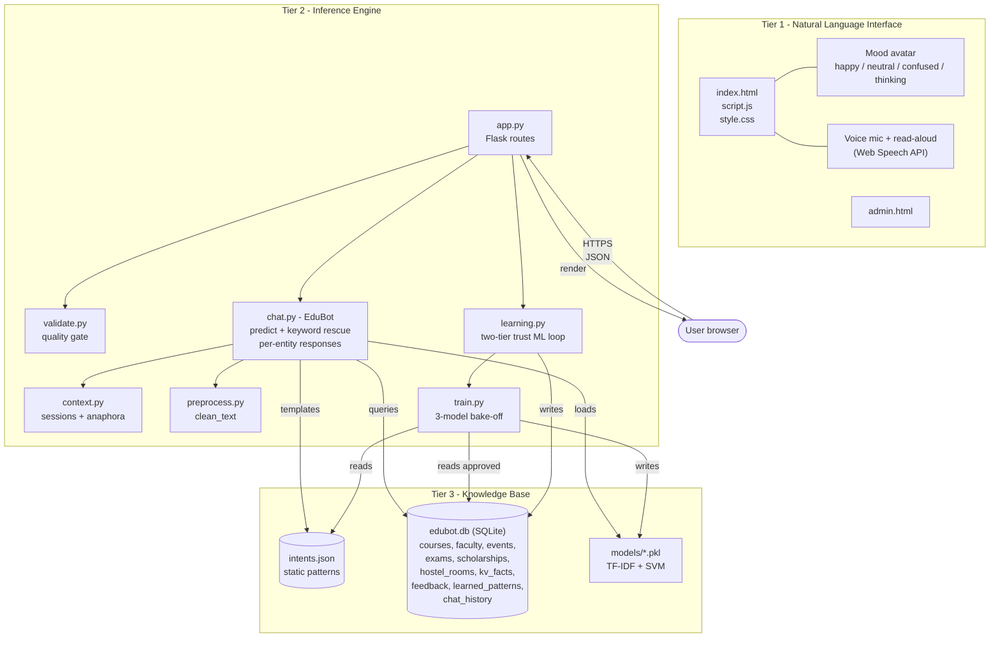

---

## 2. Use Case Diagram (MUST HAVE)

Two actors (Student and Admin) and the use cases they trigger.

Mermaid does not have a native UML use-case shape, so we use a
left-to-right flowchart with rounded actors and oval use cases -
this is the conventional Mermaid workaround and renders cleanly.

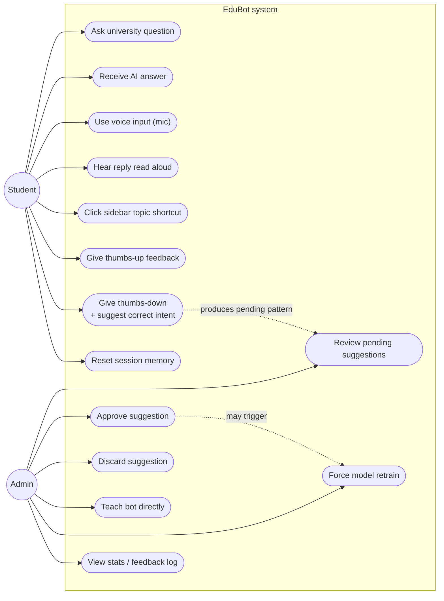

---

## 3. Activity Diagram (MUST HAVE)

End-to-end activity for a single chat turn (`POST /chat`). Covers
quality validation, anaphora resolution, the clarify branch, the
keyword rescue, entity extraction, and the four response paths.

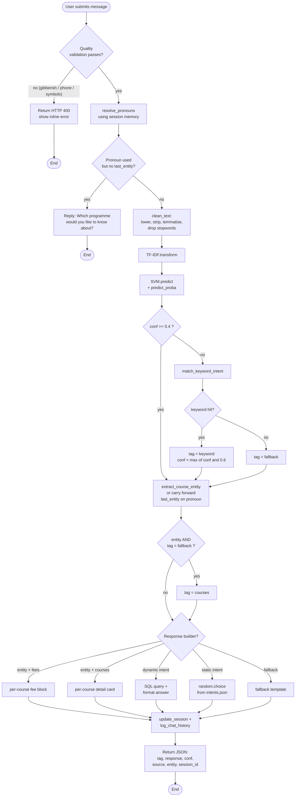

---

## 4. Sequence Diagram (MUST HAVE)

One `POST /chat` turn from user to rendered reply, showing every
collaborator. Use this in §8.3 of the technical documentation.

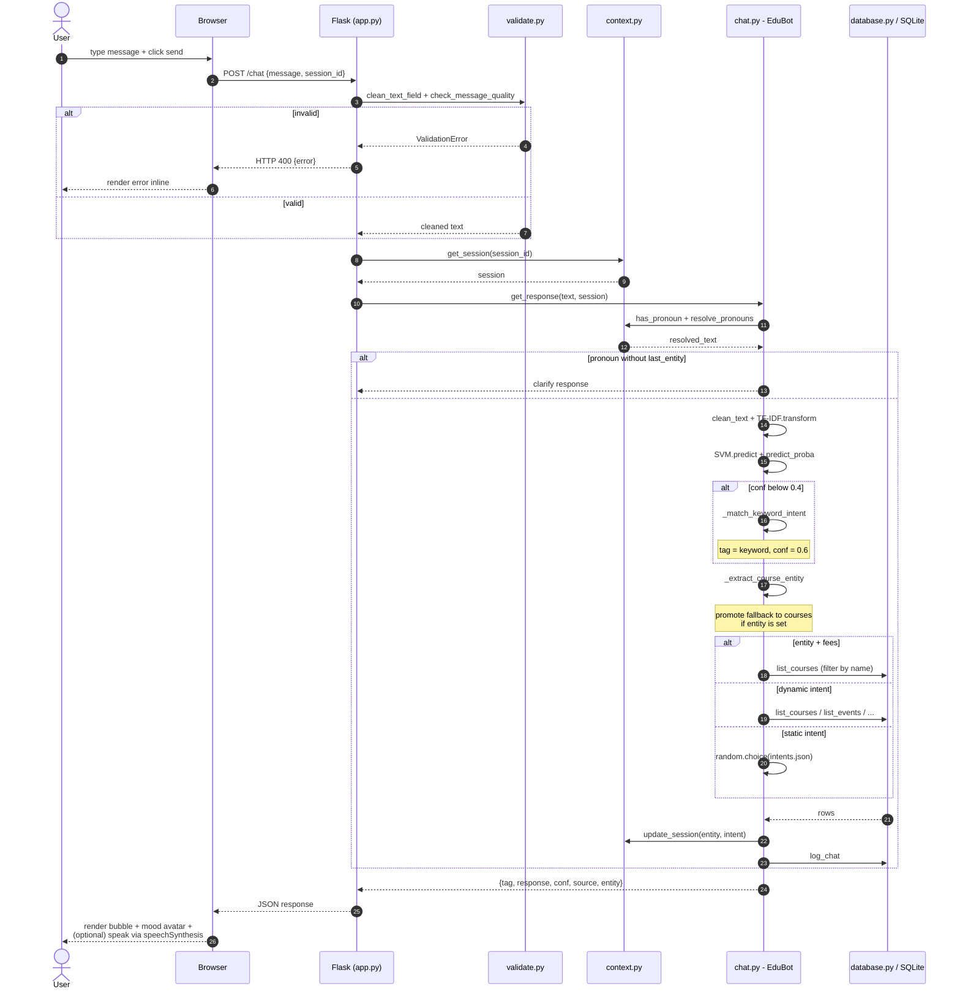

---

## 5. Class Diagram (MUST HAVE)

Logical view of the inference engine and its collaborators. Module-
level helpers are stereotyped `<<module>>`; database tables are
shown as anchored boxes.

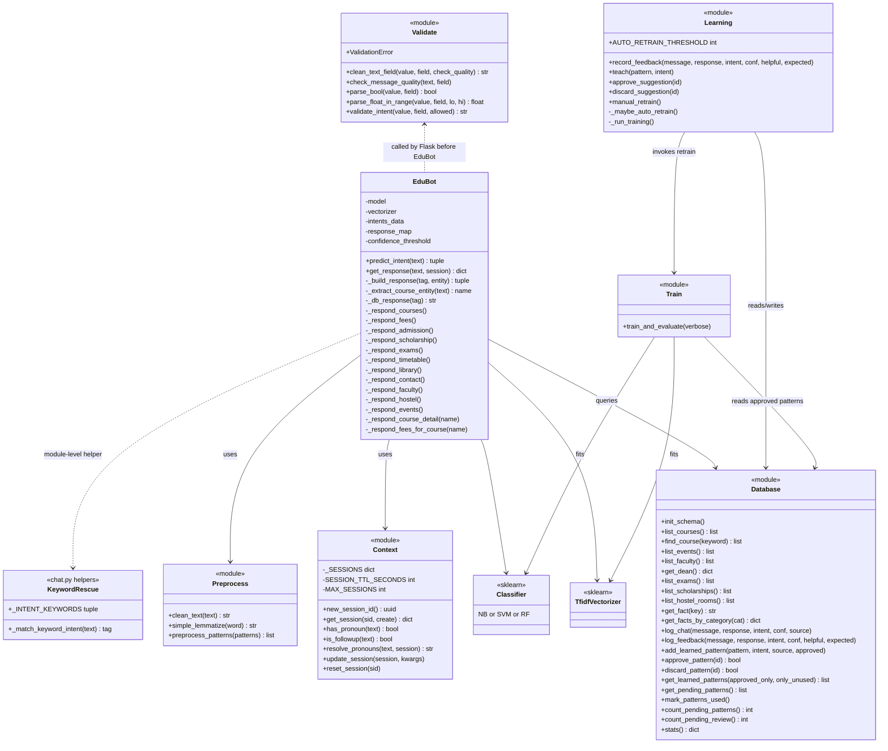

---

## 6. State Transition Diagram (MUST HAVE)

Per-request finite-state machine for `POST /chat`. The CLARIFY,
KEYWORD-RESCUE and per-entity branches are explicit so the diagram
matches the actual code path.

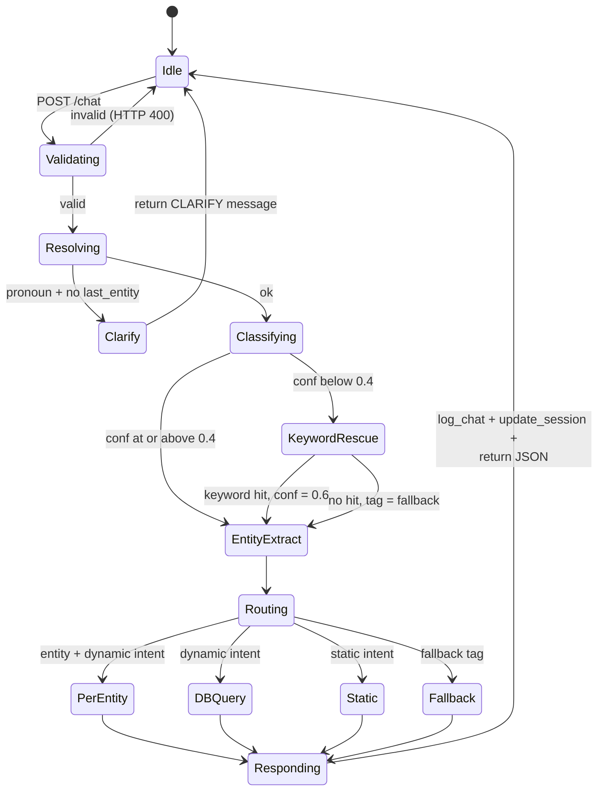

---

## 7. ER Diagram (VERY IMPORTANT)

SQLite schema. The seed tables (courses, faculty, events, etc.)
have no foreign keys — they are joined at the application layer by
intent name. The `feedback -> learned_patterns` link is logical
(feedback records that include `expected_intent` produce a row in
`learned_patterns`).

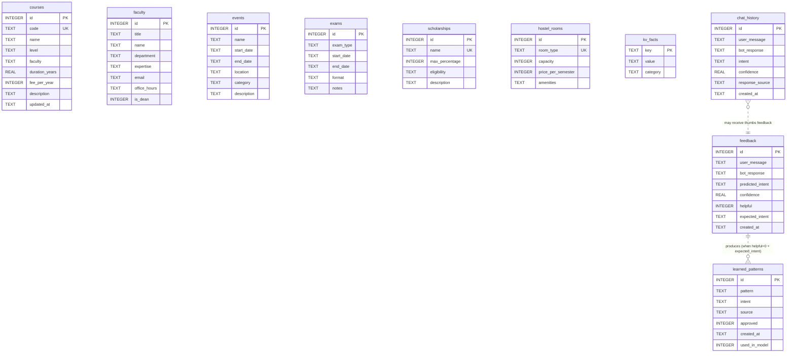

### 7-Chen. ER Diagram in Chen notation (alternative view)

The diagram above uses **Crow's Foot** notation (industry standard,
what Mermaid `erDiagram` produces natively). This second version
uses **Chen notation** (the textbook style: rectangles =
entities, ovals = attributes, diamonds = relationships).

Mermaid does not support Chen natively, so we simulate it with a
`flowchart` and shape classes. For a polished version, redraw this
in draw.io's *ER (Chen)* shape group using the spec below.

The Chen ER is split into two diagrams so each renders cleanly:

- **§7-Chen-A** - Knowledge base (7 seed entities, no relationships)
- **§7-Chen-B** - Runtime / ML (3 entities + 2 relationship diamonds)

Together they cover all 10 tables in `database.py`.

#### 7-Chen-A. Knowledge-base entities (7 read-only seed tables)

These tables have **no foreign keys to anything** - they are
queried by the bot when an intent matches their domain (e.g.
`courses` table is read when the predicted intent is `courses`).
Drawing them as isolated entity rectangles with attribute ovals is
the correct Chen rendering for read-only seed data.

```mermaid
flowchart TB
    classDef entity fill:#bfdbfe,stroke:#1e3a8a,color:#0f172a,stroke-width:2px,font-weight:bold
    classDef attr   fill:#bbf7d0,stroke:#166534,color:#0f172a
    classDef pk     fill:#fde68a,stroke:#92400e,color:#0f172a,stroke-width:2px,font-weight:bold

    %% ---------------- courses ----------------
    c_pk(("id (PK)")):::pk
    c_code(("code (UK)")):::pk
    c_name(("name")):::attr
    c_level(("level")):::attr
    c_fac(("faculty")):::attr
    c_dur(("duration_years")):::attr
    c_fee(("fee_per_year")):::attr
    c_desc(("description")):::attr
    Courses["courses"]:::entity
    c_pk --- Courses
    c_code --- Courses
    c_name --- Courses
    c_level --- Courses
    c_fac --- Courses
    c_dur --- Courses
    c_fee --- Courses
    c_desc --- Courses

    %% ---------------- faculty ----------------
    fa_pk(("id (PK)")):::pk
    fa_title(("title")):::attr
    fa_name(("name")):::attr
    fa_dept(("department")):::attr
    fa_exp(("expertise")):::attr
    fa_email(("email")):::attr
    fa_oh(("office_hours")):::attr
    fa_dean(("is_dean")):::attr
    Faculty["faculty"]:::entity
    fa_pk --- Faculty
    fa_title --- Faculty
    fa_name --- Faculty
    fa_dept --- Faculty
    fa_exp --- Faculty
    fa_email --- Faculty
    fa_oh --- Faculty
    fa_dean --- Faculty

    %% ---------------- events ----------------
    e_pk(("id (PK)")):::pk
    e_name(("name")):::attr
    e_start(("start_date")):::attr
    e_end(("end_date")):::attr
    e_loc(("location")):::attr
    e_cat(("category")):::attr
    e_desc(("description")):::attr
    Events["events"]:::entity
    e_pk --- Events
    e_name --- Events
    e_start --- Events
    e_end --- Events
    e_loc --- Events
    e_cat --- Events
    e_desc --- Events

    %% ---------------- exams ----------------
    x_pk(("id (PK)")):::pk
    x_type(("exam_type")):::attr
    x_start(("start_date")):::attr
    x_end(("end_date")):::attr
    x_fmt(("format")):::attr
    x_notes(("notes")):::attr
    Exams["exams"]:::entity
    x_pk --- Exams
    x_type --- Exams
    x_start --- Exams
    x_end --- Exams
    x_fmt --- Exams
    x_notes --- Exams

    %% ---------------- scholarships ----------------
    s_pk(("id (PK)")):::pk
    s_name(("name (UK)")):::pk
    s_pct(("max_percentage")):::attr
    s_elig(("eligibility")):::attr
    s_desc(("description")):::attr
    Scholar["scholarships"]:::entity
    s_pk --- Scholar
    s_name --- Scholar
    s_pct --- Scholar
    s_elig --- Scholar
    s_desc --- Scholar

    %% ---------------- hostel_rooms ----------------
    h_pk(("id (PK)")):::pk
    h_room(("room_type (UK)")):::pk
    h_cap(("capacity")):::attr
    h_price(("price_per_semester")):::attr
    h_amen(("amenities")):::attr
    Hostel["hostel_rooms"]:::entity
    h_pk --- Hostel
    h_room --- Hostel
    h_cap --- Hostel
    h_price --- Hostel
    h_amen --- Hostel

    %% ---------------- kv_facts ----------------
    k_pk(("key (PK)")):::pk
    k_val(("value")):::attr
    k_cat(("category")):::attr
    KV["kv_facts"]:::entity
    k_pk --- KV
    k_val --- KV
    k_cat --- KV
```

#### 7-Chen-B. Runtime / ML entities (with relationships)

These three tables are written at runtime and carry the only two
relationships in the schema:

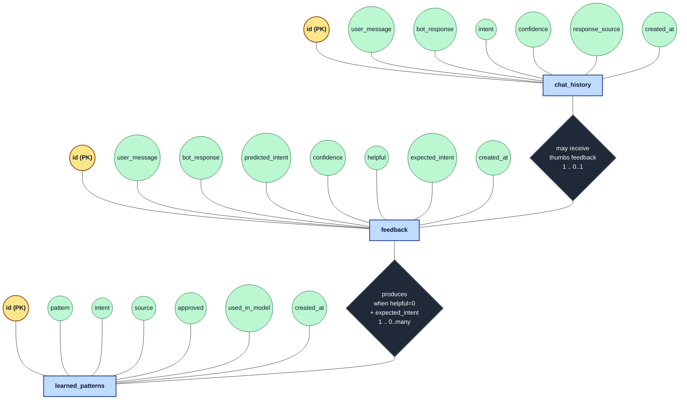

### 7-Chen-Spec. Data dictionary for manual draw.io / ERDPlus

If you redraw the full Chen ER (all 10 entities) in **draw.io** or
**ERDPlus**, use this spec as a checklist. Each entity is a
rectangle; each attribute is an oval; key attributes have
underlined labels; relationships are diamonds with cardinality
labels.

**Entities (10) and their attributes:**

| Entity | Key attributes (underline) | Other attributes |
|---|---|---|
| `courses` | id (PK), code (UK) | name, level, faculty, duration_years, fee_per_year, description, updated_at |
| `faculty` | id (PK) | title, name, department, expertise, email, office_hours, is_dean |
| `events` | id (PK) | name, start_date, end_date, location, category, description |
| `exams` | id (PK) | exam_type, start_date, end_date, format, notes |
| `scholarships` | id (PK), name (UK) | max_percentage, eligibility, description |
| `hostel_rooms` | id (PK), room_type (UK) | capacity, price_per_semester, amenities |
| `kv_facts` | key (PK) | value, category |
| `feedback` | id (PK) | user_message, bot_response, predicted_intent, confidence, helpful, expected_intent, created_at |
| `learned_patterns` | id (PK) | pattern, intent, source, approved, created_at, used_in_model |
| `chat_history` | id (PK) | user_message, bot_response, intent, confidence, response_source, created_at |

**Relationships (2):**

| Diamond | Between | Cardinality | Trigger condition |
|---|---|---|---|
| **may receive** | `chat_history` --- `feedback` | one chat row -> 0 or 1 feedback row | user clicks 👍 or 👎 |
| **produces** | `feedback` --- `learned_patterns` | one feedback row -> 0 or 1 pattern row | helpful=0 AND expected_intent is not null |

**Floating entities (no relationships):**

The 7 seed tables (`courses`, `faculty`, `events`, `exams`,
`scholarships`, `hostel_rooms`, `kv_facts`) have no foreign keys
to any other table. In a Chen diagram they appear as isolated
entity rectangles. Their **logical** link to the runtime tables
is via the `intent` string column on `chat_history` and `feedback`
- when `intent='courses'`, the bot has answered from the `courses`
table - but this is application-layer routing, not a database
relationship, so do not draw a diamond for it.

---

## 8. ML Pipeline Flowchart (VERY IMPORTANT)

The training pipeline that runs both at initial seed time and on
every auto-retrain (when 5+ approved patterns have accumulated).

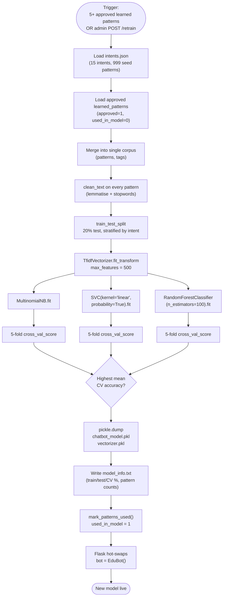

---

## 9. Feedback Learning Loop (VERY IMPORTANT)

The two-tier trust model: end users can suggest, but only admins
can approve, and only approval reaches the training set.

```mermaid
flowchart LR
    User((User)) -->|chat| Bot["EduBot<br/>POST /chat"]
    Bot -->|reply + conf badge| Render["Browser shows reply<br/>with thumbs-up / down"]

    Render -->|👍 thumbs-up| Up["POST /feedback<br/>helpful=true"]
    Render -->|👎 + suggested intent| Down["POST /feedback<br/>helpful=false<br/>expected_intent=X"]

    Up --> LogFB[("feedback table")]

    Down --> LogFB
    Down --> AddPending["add_learned_pattern<br/>approved = 0"]
    AddPending --> Pending[("learned_patterns<br/>approved=0<br/>PENDING REVIEW")]

    Admin((Admin)) -->|opens /admin| Review{"Review<br/>pending row"}

    Review -->|Discard| Delete["discard_pattern<br/>row deleted"]
    Review -->|Approve| Promote["approve_pattern<br/>approved = 1"]

    Promote --> Approved[("learned_patterns<br/>approved=1, used_in_model=0")]
    Approved --> Threshold{"count of<br/>approved-but-unused<br/>at or above 5?"}
    Threshold -->|no| Idle1["Wait for next approval"]
    Threshold -->|yes| Retrain["train_and_evaluate"]

    Admin -->|teach form| Direct["teach<br/>add_learned_pattern<br/>approved = 1"]
    Direct --> Approved

    Admin -->|Force retrain| Retrain

    Retrain --> NewPkl["New chatbot_model.pkl"]
    NewPkl --> Mark["mark_patterns_used<br/>used_in_model = 1"]
    Mark --> HotSwap["Flask: bot = EduBot"]
    HotSwap --> Bot

    style Pending fill:#fff4cc
    style Approved fill:#cce5ff
```

---

## 10. Deployment Diagram (BONUS)

How the live bot is hosted on PythonAnywhere. The browser handles
voice I/O entirely client-side via the Web Speech API, so those
calls never reach the server.

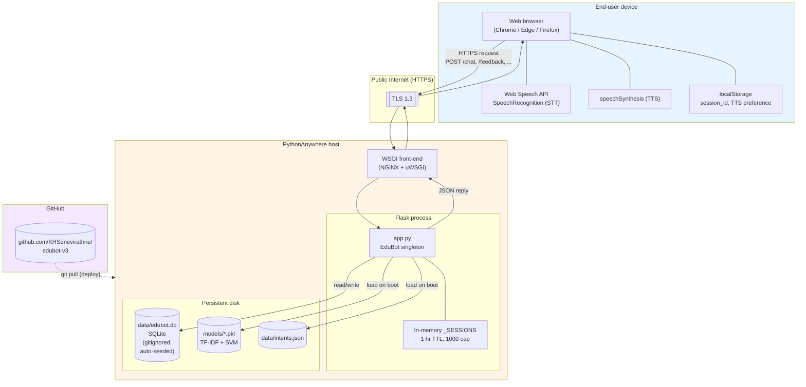

---

## Appendix - export tips

- **Mermaid Live Editor** also lets you save the diagram as a Mermaid
  link (sharable URL) - useful for collaborating with the team-mate.
- For PNG export at presentation quality, set the export scale to
  **2x** or **3x** in the Live Editor's Actions menu.
- If a diagram is too tall for one slide, render it as SVG and crop
  in PowerPoint / Keynote.
- All diagrams above were verified against the codebase as of commit
  `4719b14` (auto-seed-on-first-boot). If the code changes
  significantly, refresh the corresponding block here first, then
  the rendered image.
